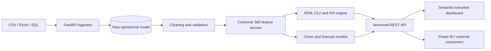

# Architecture

The system uses a service-oriented modular monolith. Business calculations live in stateless services, database access is session-scoped, APIs are versioned under `/api/v1`, and the dashboard contains presentation logic only.

## Design decisions

- PostgreSQL is the production system of record; SQLite supports zero-friction local development.
- File loads are checksum-based and idempotent.
- Models use deterministic random seeds and store run metadata.
- Customer and transaction date indexes support the dominant query paths.
- KPI definitions are centralized to prevent dashboard/API drift.
- Churn is operationally defined as no purchase for more than 90 days.
